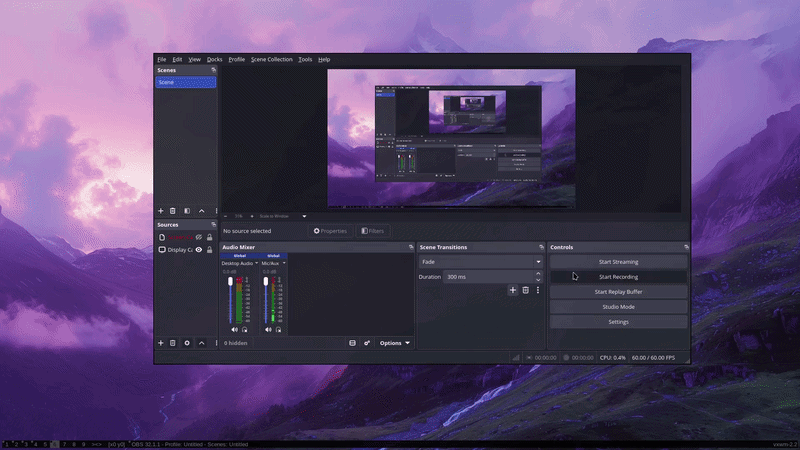

# Overtonight-Figlet

A simple C script that displays synchronized song lyrics using FIGlet with precise timing.

## Features

* **Dynamic Centering**: Automatically adjusts to your terminal window size using `ioctl`
* **ASCII Art**: Powered by `FIGlet`
* **Zero Bloat**: Pure C, no heavy dependencies

## Prerequisites

Make sure you have:

* `gcc`
* `figlet`
* Linux environment (tested on Gentoo)

## Install FIGlet

### Arch Linux

```bash
sudo pacman -S figlet
```

### Gentoo

```bash
sudo emerge app-text/figlet
```

### Debian / Ubuntu

```bash
sudo apt update
sudo apt install figlet
```

## Preview



## Installation & Usage

```bash
git clone https://github.com/troyan-22/Overtonight-Figlet.git
cd Overtonight-Figlet
gcc overtonight.c -o overtonight
./overtonight
```

## Optional: Add to PATH

```bash
cp overtonight ~/.local/bin/
```

Then run:

```bash
overtonight
```
